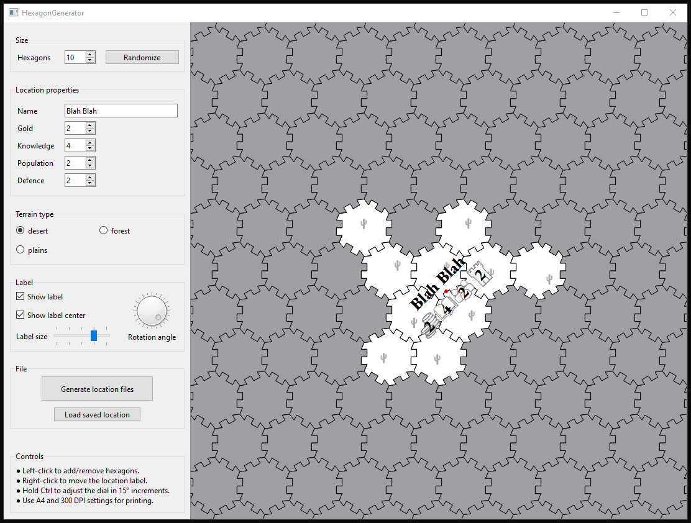
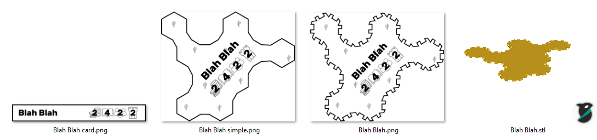

## What Is HexagonGenerator?

It is a tool for generating tileable multi-hexagonal tiles. 
These tiles are designed to interlock with each other, 
similar to puzzle pieces, making them ideal for creating custom locations in board games.

## What Does It Do?

The HexagonGenerator generates:
- A 3D mesh of a tile in STL format, ready for 3D printing.
- A 2D sticker of the location with all its statistics, designed for 2D printing and gluing on top of the 3D-printed tile.
- A simplified 2D sticker of the location, optimized for easy cutting with scissors.
- A card detailing the properties of the tile, intended for the current owner to hold.

### Creating a Location: An Example

*Screenshot of the HexagonGenerator interface.*

*Files produced by the HexagonGenerator.*

## What's Interesting About This Project?

In most board games, custom-generated maps are rarely seen. 
When they do exist, the tiles typically have uniform shapes (like in *Settlers of Catan*) or use a small number of large tiles.

HexagonGenerator is part of an effort to create a board game where all locations consist of unique,
tileable shapes, forming a one-of-a-kind map.

### What's Interesting From a Technical Point of View?

Earlier versions of this project simply generated connected hexagons without additional "teeth-like" interlocking edges. 
However, it was soon discovered that these locations would shift around during gameplay when tokens were placed on them. 
As a result, an interlocking mechanism had to be added.

Now, two locations can interlock if they share at least two edges.
This mechanism is intentionally weaker than the interlocking in traditional puzzles.
The tiles are less tightly held together, making them easier to disconnect and more suitable for repeated use in board games.

The implementation was quite interesting as it required a moderate amount of computational geometry. 
This involved generating the "teeth-like" shapes, 
offsetting all edges to ensure non-zero spacing between neighboring locations, 
and finally representing the shape as triangles with normals to create a 3D mesh.

## Project Setup

The project was built on Windows using Visual Studio 2022 with the Qt Visual Studio Tools extension.

The non-standard configuration consists of:
- Configuration Properties -> General -> C++ Language Standard: ISO C++20 Standard (/std:c++20)
- Configuration Properties -> Linker -> System -> SubSystem: Console (/SUBSYSTEM:CONSOLE)    // to enable terminal for CSV data of generated locations 

## License

This project is licensed under the **Creative Commons Attribution-NonCommercial 4.0 International License (CC BY-NC 4.0)**.

You are free to use and modify the project for non-commercial purposes as long as you provide attribution to the original author. 
For more details, see the full license here: [CC BY-NC 4.0 License](https://creativecommons.org/licenses/by-nc/4.0/)
